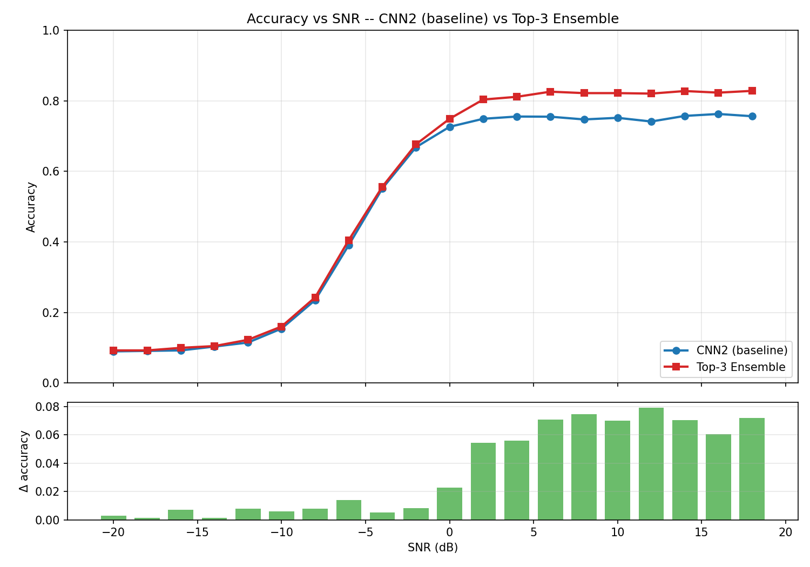

# Automatic Modulation Classification — CBAM-Enhanced CNN

> Reproducing and extending the AMR-Benchmark on RadioML 2016.10A with channel + spatial attention, Bayesian hyperparameter optimization, and top-3 ensemble.


## 🎯 Highlights

- ✅ **+3.46 percentage points** test accuracy over CNN2 baseline (49.99% → 53.45%)
- ✅ **+7 pp** at high-SNR plateau (75% → 82%)
- ✅ CBAM attention rebalances QAM16/QAM64 confusion
- ✅ Bayesian hyperparameter search reveals learning rate dominance (71% importance)
- ✅ Discovered and mitigated **proxy bias** in short-training optimization

## 📊 Results

| Model | Test Accuracy | Δ vs Baseline |
|---|---:|---:|
| CNN2 baseline | 0.4999 | — |
| CNN2 + CBAM (default) | 0.5160 | +1.61 pp |
| CNN2 + CBAM (Optuna tuned) | 0.5244 | +2.45 pp |
| **Top-3 Ensemble** | **0.5345** | **+3.46 pp** |



See [RESULTS.md](RESULTS.md) for the full analysis.

## 📁 Repository Structure

```
amc-cbam-attention/
├── config.py            # paths, constants, hyperparameters
├── data_loader.py       # pickle load + per-sample L2 + stratified split
├── models.py            # CNN2, CBAM1D, CNN2_CBAM
├── train.py             # training loop + AMP + early stopping + TensorBoard
├── tune.py              # Optuna Bayesian search (TPE + median pruning)
├── rerun_top3.py        # top-3 trial full-epoch rerun (proxy bias bypass)
├── ensemble.py          # top-3 model logit-averaging ensemble
├── evaluate.py          # accuracy-vs-SNR + confusion matrix per model
├── compare.py           # side-by-side comparison of any two models
├── visualize.py         # constellation, IQ time series, EDA
├── amc_colab.ipynb      # Google Colab runner notebook
├── colab_setup.md       # Colab setup guide
├── requirements.txt
├── README.md            # this file
├── RESULTS.md           # detailed results & analysis
└── figures/             # all generated plots
    ├── eda/             # exploratory data analysis
    ├── comparison_*/    # pairwise model comparisons
    ├── ensemble_top3/   # ensemble outputs
    └── optuna_*.png     # hyperparameter optimization plots
```

> **Note:** Dataset, processed splits, and trained checkpoints are **not** included due to size. See [setup instructions](#-getting-started) below.

## 🚀 Getting Started

### Prerequisites
- Python 3.10+
- NVIDIA GPU recommended (Tesla T4 or better) — works on CPU but slow
- ~5 GB disk space

### Installation

```bash
git clone https://github.com/<USERNAME>/amc-cbam-attention.git
cd amc-cbam-attention

python -m venv .venv
source .venv/bin/activate   # Windows: .venv\Scripts\activate
pip install -r requirements.txt
```

### Get the dataset

Download `RML2016.10a_dict.pkl` (~640 MB) from [DeepSig](https://www.deepsig.ai/datasets) and place it in `data/`:

```
data/RML2016.10a_dict.pkl
```

### Build the processed cache (one-time, ~3 min)

```bash
python data_loader.py
```

This creates `data/processed/{X,y,snr}_{train,val,test}.npy` with a 60/20/20 (mod × SNR) joint stratified split.

## 🏃 Running the Pipeline

### Option A: End-to-end on Google Colab (recommended)

Open [`amc_colab.ipynb`](amc_colab.ipynb) in Colab. Follow [`colab_setup.md`](colab_setup.md) for setup. Total GPU time on T4 (with AMP): **~2 hours**.

### Option B: Local execution

```bash
# 1. Train individual models
python train.py --model cnn2 --epochs 30 --tag baseline
python train.py --model cnn2_cbam --epochs 30 --tag cbam_v1

# 2. Hyperparameter optimization (Optuna)
python tune.py --n_trials 15 --epochs_per_trial 8 --final_epochs 30

# 3. Top-3 rerun to bypass proxy bias
python rerun_top3.py --epochs 30

# 4. Ensemble inference
python ensemble.py

# 5. Evaluate any checkpoint
python evaluate.py --ckpt runs/<RUN_NAME>/best.pt

# 6. Compare two models
python compare.py \
    --baseline runs/cnn2_<TS>_baseline \
    --cbam_metrics figures/ensemble_top3 \
    --baseline_label "CNN2 (baseline)" \
    --cbam_label "Top-3 Ensemble" \
    --out_subdir comparison_ensemble_vs_baseline
```

## 🧪 Method Overview

### Baseline: CNN2
Two-layer CNN with channel widths (256, 80) — reproduces the AMR-Benchmark baseline.

### Architectural Improvement: CBAM
Channel and spatial attention modules inserted after each conv layer:
- **Channel attention:** AvgPool + MaxPool → MLP → sigmoid
- **Spatial attention:** [avg, max] → Conv1d (k=7) → sigmoid

Only ~0.4% more parameters than baseline.

### Hyperparameter Optimization
- **Sampler:** TPE (Tree-structured Parzen Estimator)
- **Pruner:** Median (early-stop weak trials)
- **Trials:** 15 × 8 epochs
- **Objective:** SNR ≥ 0 dB validation accuracy
- **Search space:** lr, dropout, weight_decay, CBAM reduction

### Top-3 Ensemble
After identifying proxy bias in short-training optimization, we retrain the top 3 trials for 30 epochs and average their softmax probabilities.

## 📚 Reference

```bibtex
@article{zhang2022deep,
  title={Deep Learning Based Automatic Modulation Recognition: Models, Datasets, and Challenges},
  author={Zhang, F. and others},
  journal={Digital Signal Processing},
  year={2022}
}
```

- **Reference implementation:** [Richardzhangxx/AMR-Benchmark](https://github.com/Richardzhangxx/AMR-Benchmark)
- **Dataset:** [DeepSig RadioML 2016.10A](https://www.deepsig.ai/datasets)

## 👥 Authors

| Name | Role |
|---|---|
| **Ulaş Gürses** | Training, Evaluation & Documentation Lead |
| **İlhan Deger** | Model Development Lead |
| **Semih Öncel** | Visualization & Analysis Lead |
| **Alptürk İncesu** | Dataset & Preprocessing Lead |

## 📄 License

[MIT](LICENSE)
